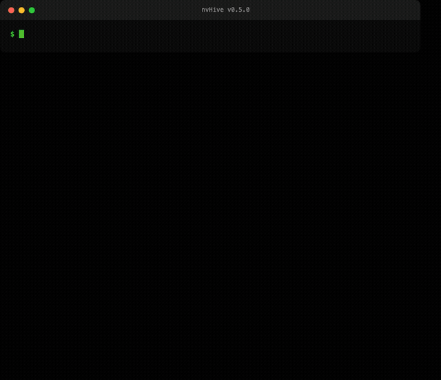
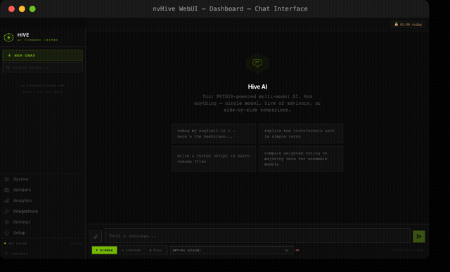
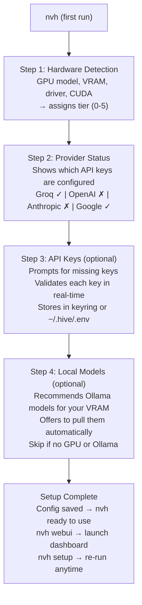
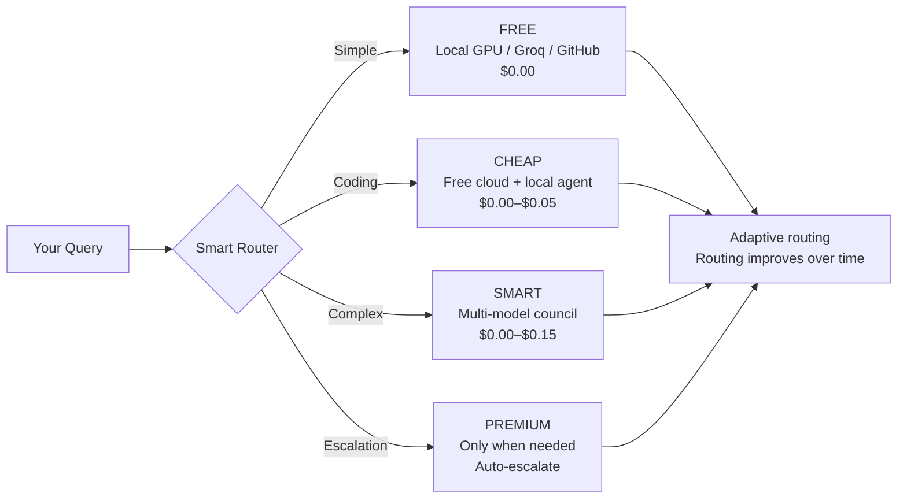
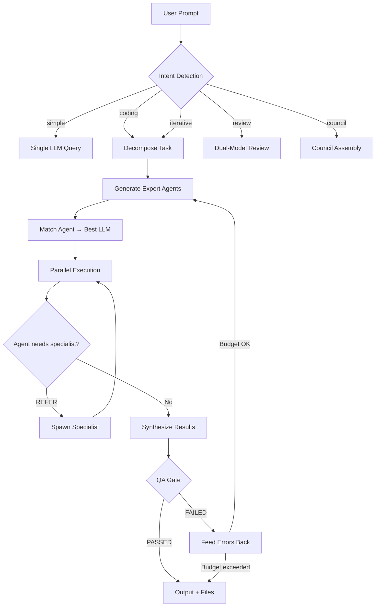
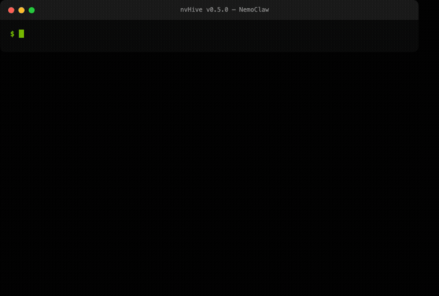
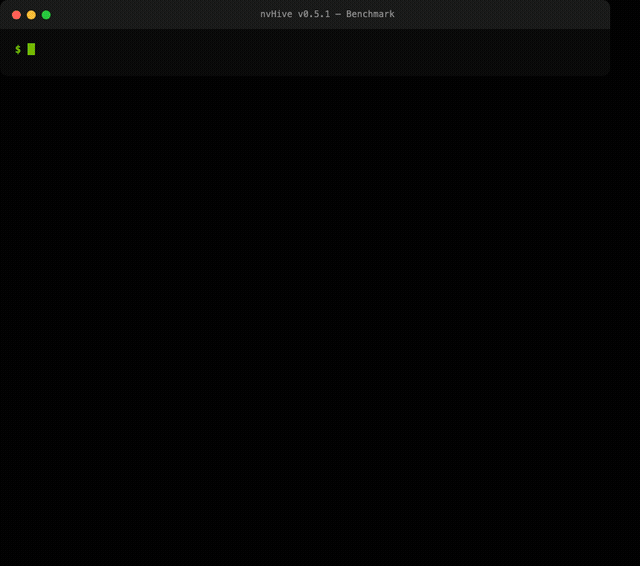

# nvHive

**One command. Every AI model you have. Automatically assembled into the best team for each task.**

   

```bash
nvh "What is a binary search tree?"              # → answers (single best advisor)
nvh "Fix the timeout bug in council.py"          # → auto-detects coding task → agent mode
nvh "Review my staged changes"                   # → auto-detects review → multi-model review
nvh "Add tests for the auth module"              # → auto-detects test request → test generation
nvh "Should we use Redis or Postgres?"           # → auto-detects debate → council (3+ advisors)
```

<p align="center">
  
</p>

---

## Get Started

```bash
pip install nvhive
nvh setup              # configure providers (validates keys)
nvh health             # check what's available
nvh "your question"    # try it
```

```bash
# With optional extras
pip install nvhive[all]      # vision + browser automation
pip install nvhive[vision]   # desktop control (pyautogui)
pip install nvhive[browser]  # browser automation (playwright)
```

<p align="center">
  
</p>

### First-Run Setup

On first run, `nvh` automatically launches a guided 4-step setup:



Works immediately with LLM7 (no signup needed). Every step is skippable — press Enter to skip. Run `nvh setup` anytime to reconfigure.

**GPU tier → model recommendations:**

| VRAM | Tier | What nvh recommends | Behavior |
|------|------|-------------------|----------|
| 0 GB (no GPU) | Tier 0 | Cloud only | Free tiers first (Groq, LLM7, GitHub) |
| 8–16 GB | Tier 1 | `nemotron-mini` / `qwen2.5:7b` | Simple queries local, complex → cloud |
| 16–24 GB | Tier 2 | `gemma3:12b` / `mistral-small` | Most Q&A local, coding → cloud assist |
| 24–48 GB | Tier 3 | `gemma4:27b` / `qwen2.5:32b` | Local worker + cloud orchestrator |
| 48–96 GB | Tier 4 | `llama3.3:70b` + `qwen2.5:32b` | Dual-model: 70B planner + 32B coder |
| 128 GB+ | Tier 5 | 3× 70B models | Full local council, $0, fully private |

Setup auto-detects your VRAM and recommends from this table. You choose what to pull.

<details>
<summary><b>NVIDIA GPU Quick Start</b> — local inference on your hardware</summary>

```bash
# 1. Install Ollama (if not already installed)
curl -fsSL https://ollama.com/install.sh | sh

# 2. Install and run nvHive — it handles the rest
pip install nvhive
nvh    # first-run setup auto-detects your GPU, recommends + pulls the right models
```

That's it. The guided setup detects your GPU via pynvml (VRAM, driver, CUDA version), recommends models sized for your hardware, and offers to pull them. After setup:

- Simple queries route to your GPU automatically — $0, private, nothing leaves your machine
- Complex queries escalate to cloud only when local models aren't confident enough
- `nvh safe "question"` forces all inference local — guaranteed no cloud
- `nvh bench` measures your GPU's actual tok/s against community baselines
- The adaptive routing engine measures quality over time and adjusts thresholds automatically

</details>

---

## Why nvHive

**Council scored 68% higher than a single model — at $0 cost.** Three free providers (Ollama + Groq + Google) running in parallel outperformed a single Nemotron Super on accuracy, completeness, and coherence. Real benchmark on NVIDIA DGX Spark. [See full results below.](#benchmark-results)

**You type one command. nvHive figures out the rest.** It detects what you're asking for, checks which advisors are healthy, and assembles the best team for the task — automatically. More advisors connected = smarter behavior, with zero configuration.

**What makes it different:**

- **Smart team assembly.** nvHive doesn't just route to one model — it generates expert agents based on your question and matches each one to the best LLM for their specialty. A "Security Engineer" agent gets routed to a provider strong at security tasks. A "Database Expert" gets one suited to database queries. Based on adaptive routing data once sufficient queries are collected, with curated defaults for new installations.
- **Automatic orchestration.** Coding tasks get a planner + coder + reviewer. Complex questions get a council of specialists. Simple questions get the fastest advisor. All automatic based on intent detection and available advisors.
- **Scales with what you have.** 1 provider? Single-model answers. 3+ providers? Council automatically on complex questions, multi-model verification on code. Local GPU? Free inference alongside cloud. DGX Spark? Three 70B models in parallel, fully local.
- **Performant by default.** Uses all available advisors within reason. Simple questions don't trigger council. Budget limits always enforced. Switch to cost mode for minimal spend.
- **4-layer safety guardrails.** Command blocklist, filesystem boundary enforcement, secrets redaction, and resource limits — guardrails block destructive commands like `rm -rf /`.



---

## How It Works

### Architecture Overview



### Query Pipeline

**Task classification:** TF-IDF cosine similarity against an 88-example training corpus (13 task types), with regex-pattern fallback when confidence is below threshold.

**Provider scoring:** Weighted composite — capability (40%), cost (30%), latency (20%), health (10%). Capability scores start from static estimates and are refined to measured performance via exponential moving average.

### Provider Routing

**Adaptive routing:** After every query, nvHive records the outcome and updates scores. By 20 queries per provider/model/task combination, routing is fully data-driven. Each request is scored across capability (40%), cost (30%), latency (20%), and health (10%), then routed to the highest-scoring provider. On failure, nvHive tries the next provider in the fallback chain, and every failure feeds back into the health score.

```bash
nvh routing-stats    # see learned vs static scores
nvh health           # provider resilience dashboard
```

**Local-first with NVIDIA GPUs:** Simple queries route to Nemotron on your NVIDIA GPU via Ollama — no cloud, no cost, no data leaving your machine. GPU detection via pynvml reads VRAM, driver version, and CUDA version to select the optimal local model. The `--prefer-nvidia` flag gives a 1.3x routing bonus to keep inference on NVIDIA hardware whenever quality allows.

---

## Agentic Coding

> Multi-model coding agent with dynamic expert referral, iterative QA refinement, parallel execution, and vision/browser tools. Scales from no-GPU to DGX Spark.

```bash
# One-time setup: pulls the right models for your GPU
nvh agent --setup

# Run a coding task
nvh agent "Fix the streaming timeout bug in council.py"
nvh agent "Add unit tests for the auth middleware" --dir ./myproject
nvh agent "Refactor the router to use health-aware selection" -y

# Advanced: sandbox, workspace, parallel pipeline
nvh agent "Build the notification service" --sandbox     # Docker-isolated execution
nvh agent "task" --workspace ./api,./frontend             # multi-repo context
nvh agent "refactor the auth module" --sandbox  # runs in Docker container
```

**How it works:** Intent detection classifies the task, the orchestrator generates expert agents matched to the best LLMs, agents run in parallel where possible, dynamic expert referral fills knowledge gaps on-demand, and an iterative QA loop refines until the task is completed. See the [Architecture Overview](#architecture-overview) diagram above for the full flow.

```bash
nvh agent "task" --iterative               # enable iterative QA refinement
nvh agent "task" --iterative --budget 2.50  # cap spend at $2.50
```

### Key Capabilities

| Feature | What It Does |
|---------|-------------|
| **Dynamic Expert Referral** | Agents self-identify knowledge gaps and emit `REFER: Need a Database Expert for sharding` — the system dynamically spawns the specialist, gets the answer, and feeds it back. Max depth prevents infinite recursion. |
| **Iterative QA Refinement** | Generate agents → run with referrals → post-QA reviews → if gaps found, spawn new agents informed by feedback → repeat until PASSED or budget exhausted. |
| **Parallel Pipeline** | Decomposes tasks into independent subtasks, runs them concurrently (bounded semaphore), respects dependencies, VRAM-aware model swapping with context preservation. |
| **Vision + Desktop Control** | Screenshot capture, image analysis via vision LLMs (GPT-4o, Claude, Gemini, LLaVA), OCR, mouse/keyboard automation with pyautogui. Agents can see and interact with GUIs. |
| **Browser Automation** | Headless browser navigation, screenshots, form filling via Playwright. HTTP requests, process management, Docker tools. |
| **Docker Sandbox** | `--sandbox` flag runs agent shell commands inside a Docker container — memory-limited, CPU-limited, no network by default, non-root user. Falls back to local if Docker unavailable. |
| **Execution Checkpoints** | File state snapshots before execution. Automatic rollback on failure — restores modified files, deletes newly created ones. |
| **LLM Drift Detection** | Monitors provider quality over time using EMA. Alerts when a provider drops >20% vs historical average. Auto-reroutes traffic away from degraded providers. |
| **Code Analysis** | Static analysis for code smells (long functions, deep nesting, complex conditionals, magic numbers, missing docstrings), tech debt scoring, complexity hotspots, missing test detection. |
| **Multi-Repo Workspaces** | `--workspace` aggregates multiple repos into a single agent context. Cross-repo import detection, language detection, shared file patterns. Read-only support for reference repos. |
| **VS Code Extension** | Agent tasks, code review, test generation, council queries, and explain — all from the VS Code sidebar. Auto-starts `nvh serve` if needed. |

**Scales with your hardware — 6 tiers from no-GPU to DGX Spark:**

| GPU | VRAM | Tier | Models | Mode |
|-----|------|------|--------|------|
| DGX Spark | 128 GB | Tier 5 | Nemotron 70B + Llama 70B + Qwen 72B (3 models, all local) | Multi |
| RTX 6000 Pro BSE | 96 GB | Tier 4 | Cloud planner + Llama 70B coder + Qwen 32B reviewer (dual local) | Multi |
| A100 / A6000 | 48-80 GB | Tier 3 | Cloud planner + Llama 70B coder (`--mode multi` for dual local) | Auto |
| RTX 3090 / 4090 | 24 GB | Tier 2 | Cloud planner + Gemma 2 27B coder | Single |
| RTX 4060 Ti | 16 GB | Tier 1 | Cloud planner + Qwen Coder 7B | Single |
| No GPU | — | Tier 0 | Fully cloud | Single |

```bash
nvh agent --setup                    # pull recommended models
nvh agent --remove                   # clean up models
nvh agent "task" --mode multi        # force multi-model (Tier 3+)
nvh agent "task" --mode single       # force single model
nvh agent "task" --git               # auto-branch + commit changes
nvh agent "task" --no-quality        # skip lint/syntax gates
```

**Multi-model mode** (Tier 4-5, or `--mode multi` on Tier 3): a DIFFERENT model reviews the coder's output, catching bugs the coder's architecture has blind spots for. Cross-model verification is measurably better than self-review.

**Quality gates**: after the agent modifies files, ruff lint + syntax checks run automatically. If they fail, the agent gets the errors and fixes them in a feedback loop.

### Code Review (`nvh review`)

```bash
nvh review                     # review staged changes
nvh review HEAD~3..HEAD        # review last 3 commits
nvh review 42                  # review GitHub PR #42
nvh review --mode multi        # two models review independently
```

Multi-model code review: two different LLM architectures review independently, then findings are synthesized. Catches bugs that self-review and single-model review miss.

### Test Generation (`nvh test-gen`)

```bash
nvh test-gen nvh/core/council.py     # generate tests for a file
nvh test-gen --coverage-gaps         # find and fill coverage gaps
```

Reads your code, identifies untested paths, generates pytest tests, runs them, and iterates until they pass. The agent that improves itself — it writes the tests that verify its own future changes.

---

## Council Mode

When one model isn't enough, nvHive runs the same query through multiple providers in parallel, then synthesizes their responses. Expert personas are generated for the query (e.g., Backend Engineer, Architect, DBA), each assigned to a different model. Responses are collected, analyzed for agreement using keyword overlap and an LLM judge, and then synthesized by a non-member provider (where available) into a final council response with a confidence score and individual perspectives.

**Why this works:** Different models have different blind spots. Council mode surfaces all perspectives and synthesizes the best of each.

**Confidence scoring:** Every council response includes an agreement metric (e.g., "Strong consensus" vs "Split decision") based on pairwise response similarity. Tells you when to trust the consensus.

**Cost:** Council with 3 free providers costs $0. Council with 3 Nemotron variants on a single NVIDIA GPU costs $0 and never leaves your machine. Premium cloud council costs ~3x a single query.

```bash
nvh convene "Should we use Redis or Postgres for session storage?"
# → 3 models debate → synthesis with confidence score
```

### Throwdown Mode — Two-Pass Deep Analysis

Throwdown goes beyond council. Three passes, each building on the last. In the first pass, three experts analyze the query independently. In the second pass, each expert critiques the others — finding blind spots and challenging assumptions. The final synthesis integrates all perspectives into a single, thoroughly vetted answer.

```bash
nvh throwdown "Review this architecture for scalability issues"
# Pass 1: 3 experts analyze independently
# Pass 2: experts critique each other's analysis
# Pass 3: final synthesis integrating all perspectives
```

**Why throwdown beats single-model:** A single model gives you one perspective, once. Throwdown gives you three perspectives, challenged by three critiques, then synthesized. Errors get caught. Assumptions get questioned. The final answer is more thorough than any single pass.

---

## Smart Query Features

```bash
# Confidence-gated escalation: try free first, upgrade only if needed
nvh ask --escalate "Design a distributed lock manager"
# → groq (free, confidence: 42%) → auto-escalated to openai

# Cross-model verification: a second model checks the answer
nvh ask --verify "Is eval() safe in Python?"
# → groq answers → google verifies (9/10, no issues)

# Both together: cheapest possible verified answer
nvh ask --escalate --verify "Explain the CAP theorem"
```

---

## Local GPU Inference with Nemotron

`nvh setup` detects your NVIDIA GPU, selects which models fit in your VRAM, and pulls them automatically. Supports both [NVIDIA Nemotron](https://build.nvidia.com/) and [Google Gemma 4](https://ai.google.dev/gemma) (NVIDIA-optimized) for local council with two different architectures.

VRAM determines which models run locally: with no VRAM you get cloud-only routing (free tiers first); 8-24 GB runs small 7B models locally alongside cloud; 24-48 GB runs medium 27B models with a cloud planner; 48-96 GB runs large 70B models with a cloud orchestrator; and 128 GB+ (DGX Spark) runs all models locally at $0, fully private.

<p align="center">
  
</p>

```bash
nvh setup
# Step 3/3: Local GPU inference
#   Detected: NVIDIA GeForce RTX 4090 (24GB VRAM)
#   Models: nemotron-small, gemma4:26b
#   Pulling nemotron-small... ✓
#   Pulling gemma4:26b... ✓
#   Local council ready — multiple models for consensus
```

**What `nvh setup` handles:** GPU detection via pynvml reads your VRAM, driver, and CUDA version. Based on available VRAM, it selects the optimal models — small models for modest GPUs, dual-architecture setups (Nemotron + Gemma 4) for mid-range cards, and full 70B models for high-end hardware. It checks whether Ollama is installed and running, then auto-pulls all models that fit. Once complete, the adaptive routing engine tracks each model's quality on your specific hardware.

**After setup, routing is automatic:**
- Simple queries → local Nemotron or Gemma 4 on your GPU (free, private)
- Council mode → both models collaborate locally, catching different blind spots
- Complex queries → cloud providers when local quality isn't sufficient
- `nvh bench` measures your GPU's actual tok/s with community baselines
- The adaptive routing engine measures each model's quality on YOUR hardware

[Full GPU detection + VRAM guide](docs/GPU_DETECTION.md)

### NVIDIA Inference Stack

| Layer | Technology | Hardware | Use Case |
|-------|-----------|----------|----------|
| **Local** | Ollama + Nemotron | Consumer GPUs (RTX 3060+) | Default local inference, privacy mode |
| **Local** | Ollama + Gemma 4 | Consumer GPUs (RTX 3060+) | NVIDIA-optimized, reasoning + multimodal |
| **Cloud** | NVIDIA NIM API | NVIDIA cloud | Specialized models, 1000 free credits |
| **Enterprise** | Triton Inference Server | H100 / A100 / L40 | Production multi-model serving, TensorRT-LLM |
| **Agent** | NemoClaw / OpenShell | Any | Agent orchestration with nvHive routing |
| **Detection** | pynvml | Any NVIDIA GPU | VRAM, driver, CUDA, temp, power, PCIe |

`--prefer-nvidia` gives a 1.3x routing bonus to all NVIDIA-backed providers, keeping inference on NVIDIA hardware whenever quality allows.

---

## Integrations

### How nvHive Connects to Your Tools

nvHive exposes multiple integration surfaces: a CLI (`nvh`), a web dashboard (`nvh webui`), a Python SDK (`import nvh`), an MCP server for Claude Code, and OpenAI/Anthropic-compatible API proxies. All integrations feed through the same adaptive router, council engine, and 4-layer guardrails, routing to your local GPU, free cloud providers, paid cloud, or NVIDIA NIM as appropriate.

**API Proxies** — point existing SDKs at nvHive:

| SDK | Configuration |
|-----|--------------|
| Anthropic | `ANTHROPIC_BASE_URL=http://localhost:8000/v1/anthropic` |
| OpenAI | `OPENAI_BASE_URL=http://localhost:8000/v1/proxy` |
| Claude Code | `claude mcp add nvhive -- python -m nvh.mcp_server` |

### Works With OpenClaw & NemoClaw

nvHive works alongside OpenClaw as a routing layer, and integrates with [NemoClaw](docs/NEMOCLAW.md) (NVIDIA's agent framework) as both inference provider and MCP tool server.

<p align="center">
  
</p>

```bash
nvh migrate --from openclaw    # import your existing API keys
nvh nemoclaw --start           # start proxy for NemoClaw agents
```

*Note: Anthropic recently changed billing for third-party tools. See the [integration guide](docs/OPENCLAW_MIGRATION.md) for details.*

---

## Security Model

4-layer guardrails protect your system. Agents are designed to keep within the project directory, block destructive commands, and prevent secret leakage. Docker sandbox adds container isolation.

**How the guardrails work:** Every agent command passes through four layers in sequence. First, a blocklist rejects known-dangerous commands (rm -rf, mkfs, etc.). Second, path boundary enforcement checks that all file operations stay within the project directory. Third, secrets redaction strips API keys and credentials from agent context. Fourth, resource limits cap execution time and memory. If `--sandbox` is enabled, commands run inside a Docker container with memory/CPU limits, no network access, and a non-root user. All executions are checkpointed so changes can be rolled back on failure.

---

## For Tool Builders

nvHive is a routing layer. Any AI application can add multi-provider routing:

```python
import nvh

# Drop-in OpenAI-compatible interface
response = await nvh.complete([
    {"role": "user", "content": "Explain quicksort"}
])

# Inspect routing without executing
decision = await nvh.route("complex question about databases")

# Council consensus
result = await nvh.convene("Architecture review", cabinet="engineering")

# Provider health check
status = await nvh.health()
```

[SDK & API reference](docs/SDK_API.md)

---

## Core Commands

### Agentic Coding

| Command | What It Does |
|---------|-------------|
| `nvh agent "task"` | Dynamic expert referral + iterative QA refinement (6 GPU tiers) |
| `nvh agent --setup` | Pull recommended local models for your GPU |
| `nvh agent --mode multi` | Force multi-model: separate planner, coder, reviewer |
| `nvh agent --sandbox` | Execute shell commands inside a Docker container |
| `nvh agent --workspace ./a,./b` | Multi-repo context for cross-project tasks |
| `nvh agent --git` | Auto-create branch + commit changes |
| `nvh review` | Multi-model code review (staged changes, PRs, commit ranges) |
| `nvh test-gen file.py` | AI test generation with automatic verification |
| `nvh analyze ./src` | Code smells, tech debt score, complexity hotspots |
| `nvh drift` | Check for LLM quality degradation across providers |

### Queries & Council

| Command | What It Does |
|---------|-------------|
| `nvh "question"` | Smart route to best available model |
| `nvh convene "question"` | Council consensus (3+ models collaborate) |
| `nvh throwdown "question"` | Two-pass deep analysis with critique |
| `nvh poll "question"` | Side-by-side provider comparison |
| `nvh safe "question"` | Local only — nothing leaves your machine |
| `nvh ask --escalate` | Try free first, escalate if uncertain |
| `nvh ask --verify` | Cross-model verification |

### Infrastructure

| Command | What It Does |
|---------|-------------|
| `nvh serve` | Start the API server (OpenAI + Anthropic compatible proxy) |
| `nvh webui` | Launch the web dashboard |
| `nvh health` | Provider resilience dashboard |
| `nvh nvidia` | NVIDIA GPU infrastructure status |
| `nvh bench` | GPU speed test (tokens/sec) |
| `nvh setup` | Interactive provider setup |
| `nvh doctor` | Full diagnostic dump for troubleshooting |

[Full command reference](docs/COMMANDS.md) (50+ commands)

## Providers

**23 providers. 63 models. 25 free — no credit card required.**

| Tier | Providers | Rate Limits |
|------|-----------|-------------|
| **Free (no signup)** | Ollama (local), LLM7 | Unlimited / 30 RPM |
| **Free (email signup)** | Groq, GitHub Models, Cerebras, SambaNova, Cohere, AI21, SiliconFlow, HuggingFace | 15-30 RPM |
| **Free (account)** | Google Gemini, Mistral, NVIDIA NIM | 15-1000 RPM |
| **Paid** | OpenAI, Anthropic, DeepSeek, Fireworks, Together, OpenRouter, Grok | Pay per token |

---

## Benchmark Results

Real data from NVIDIA DGX Spark (GB10, 120GB). Judged by OpenAI with ground truth verification on math prompts.

### Quality: Council vs Single Model

| Mode | Accuracy | Completeness | Coherence | **Overall** | Cost |
|------|----------|-------------|-----------|---------|------|
| Single Model (Nemotron Super) | 5.5 | 5.7 | 5.0 | **5.1** | $0.00 |
| **Council (Free: Ollama + Groq + Google)** | **9.0** | **8.0** | **9.0** | **8.6** | **$0.00** |

In our reference benchmark (16 prompts, DGX Spark hardware, judged by OpenAI), council consensus scored **68% higher** than a single model on the same prompts. Ground truth verification on math problems caught errors the single model missed. Results will vary by hardware and workload — run `nvh bench` to measure on your setup.

### Speed: Models on DGX Spark

| Model | Size | tok/s |
|-------|------|------:|
| gemma3 | 3.3 GB | **119.3** |
| nemotron-mini | 2.7 GB | **85.7** |
| gemma4 (e4b) | 9.6 GB | **61.7** |
| llama3.1 | 4.9 GB | **48.2** |
| nemotron-3-super | 86 GB | **23.6** |

### Run It Yourself

<p align="center">
  
</p>

```bash
nvh bench              # GPU speed (tokens/sec)
nvh bench -q           # speed + quality comparison
nvh health             # provider resilience
nvh why                # explain last routing decision
nvh estimate --gpu rtx_4090   # predict tok/s on any GPU
```

16 prompts across code generation, debugging, reasoning, math, creative writing, and Q&A. LLM judge + ground truth verification. Run it yourself. Publish the results.

## Learn More

| Guide | Description |
|-------|-------------|
| [Getting Started](docs/GETTING_STARTED.md) | First-time setup |
| [Commands](docs/COMMANDS.md) | Full CLI reference (50+ commands) |
| [Providers](docs/PROVIDERS.md) | 23 providers, rate limits, free tiers |
| [Council System](docs/COUNCIL.md) | Multi-LLM consensus with confidence scoring |
| [Releasing](docs/RELEASING.md) | Release runbook, version bumps, PyPI publishing |
| [Windows Troubleshooting](docs/TROUBLESHOOTING_WINDOWS.md) | Encoding, segfaults, port 80, nvh.exe locks |
| [GPU Detection](docs/GPU_DETECTION.md) | Auto-detection, model selection, OOM protection |
| [Claude Code](docs/CLAUDE_CODE_INTEGRATION.md) | MCP server setup |
| [NemoClaw](docs/NEMOCLAW.md) | NVIDIA NemoClaw integration |
| [OpenClaw Integration](docs/OPENCLAW_MIGRATION.md) | Works alongside OpenClaw |
| [SDK & API](docs/SDK_API.md) | Python SDK, REST API, proxies |
| [Deploy Without Root](docs/DEPLOY_NO_ROOT.md) | No-root install on servers (Ollama, keyring, systemd user service) |
| [Web UI](docs/WEBUI.md) | Web UI |
| [Agent Tools](docs/TOOLS.md) | Agent tools |
| [Configuration](docs/CONFIGURATION.md) | Configuration |
| [Architecture](docs/ARCHITECTURE.md) | System design and adaptive routing |

---

## Important Notes

- **Data Privacy**: When using cloud providers, queries are transmitted to third-party APIs (OpenAI, Anthropic, Google, Groq, etc.) subject to each provider's privacy policy. Use `nvh safe` or `--prefer-nvidia` to keep all inference local.
- **AI Accuracy**: AI-generated outputs may contain errors. Review agent-modified files before committing to production. nvHive provides guardrails and rollback but does not guarantee output correctness.
- **Provider Liability**: nvHive is a routing and orchestration layer. Response quality, availability, and pricing are determined by third-party providers and subject to change.
- **Security**: Safety guardrails use pattern-matching heuristics and may not catch all edge cases. For sensitive environments, use `--sandbox` with Docker isolation.
- **Benchmarks**: Benchmark results measured on NVIDIA DGX Spark reference hardware. Results vary by hardware, provider, and workload.
- **QA Gate**: The iterative QA reviewer is an LLM judge (not a static analysis tool). QA verdicts are probabilistic assessments, not deterministic guarantees.

## License

MIT License. See [LICENSE](LICENSE) for details.
