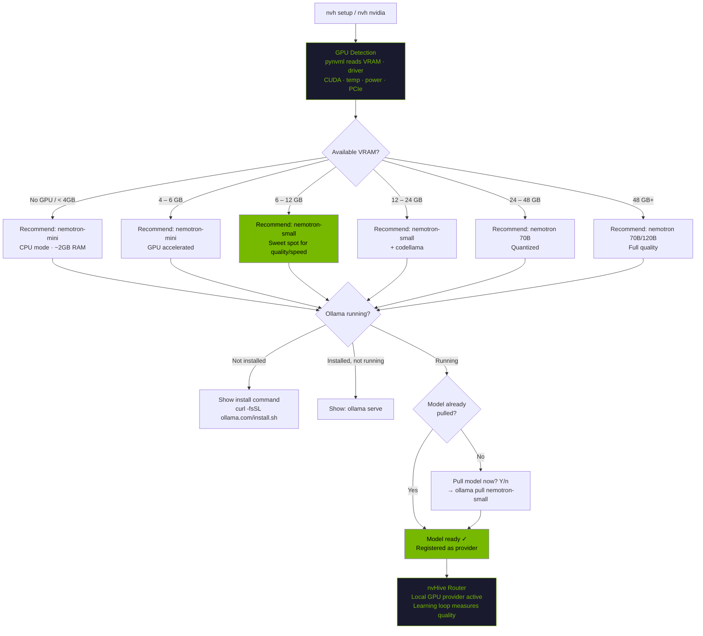

# GPU Detection & Model Selection

nvHive auto-detects your GPU hardware and selects the optimal Nemotron model for local inference. No manual configuration needed.

<p align="center">
  
</p>

## How It Works



## Model Recommendations by VRAM

| VRAM | Nemotron | Gemma 4 | Both Fit? | Use Case |
|------|---------|---------|:---------:|----------|
| No GPU / < 4 GB | `nemotron-mini` | `gemma4:e2b` | ✓ | CPU mode |
| 4 – 6 GB | `nemotron-mini` | `gemma4:e4b` | ✓ | GPU accelerated |
| **6 – 12 GB** | **`nemotron-small`** | **`gemma4:e4b`** | **✓** | **Recommended sweet spot** |
| 12 – 19 GB | `nemotron-small` | `gemma4:e4b` | ✓ | Both fit comfortably |
| 20 – 24 GB | `nemotron-small` | `gemma4:26b` | ✓ | Reasoning + multimodal |
| 24 – 39 GB | `nemotron` (70B) | `gemma4:e4b` | ✓ | Full Nemotron + lightweight Gemma |
| 40 – 48 GB | `nemotron` (70B) | `gemma4:26b` | ✓ | Both full-size models |
| 48 GB+ | `nemotron` (70B) | `gemma4:31b` | ✓ | Maximum quality |

**Local council:** Pull both Nemotron and Gemma 4 to run fully local council with two different model architectures. Different architectures catch different blind spots.

Multi-GPU systems: Ollama automatically distributes layers across all detected GPUs.

## GPU Detection Details

nvHive uses **pynvml** (NVIDIA Management Library Python bindings) for direct GPU access. Falls back to parsing `nvidia-smi` output if pynvml is not installed.

### What pynvml reads:
- GPU model name (e.g. "NVIDIA GeForce RTX 4090")
- Total and available VRAM
- Driver version and CUDA version
- GPU utilization percentage
- Temperature (Celsius)
- Power draw and power limit (watts)
- GPU and memory clock speeds (MHz)
- PCIe generation and width
- Running processes using the GPU

### What nvidia-smi reads (fallback):
- GPU model name
- Total and used VRAM
- Driver version
- GPU utilization

```bash
# Install pynvml for full detection (optional — nvidia-smi fallback works)
pip install nvidia-ml-py3

# See what nvHive detects
nvh nvidia
```

## Automatic Setup via `nvh setup`

The easiest way to get local inference running is `nvh setup`. Step 3 handles everything:

1. Detects your GPU and recommends the optimal Nemotron model
2. Checks if Ollama is installed and running
3. Checks if the recommended model is already pulled
4. If not, asks: "Pull nemotron-small now? [Y/n]"
5. After pulling, registers the model with nvHive's router

No manual configuration needed. One wizard, zero to local GPU inference.

## Commands

```bash
# Full setup wizard (includes GPU detection + model pull)
nvh setup

# GPU + inference stack status
nvh nvidia

# Benchmark your GPU (tokens/sec)
nvh bench

# Force all queries to local GPU
nvh safe "your question"

# Routing bonus for NVIDIA hardware
nvh --prefer-nvidia "your question"

# Or set permanently
nvh config set defaults.prefer_nvidia true
```

## OOM Protection

nvHive checks if a model fits in your GPU VRAM before loading:

- **Fits in VRAM**: Full GPU acceleration, best performance
- **Partially fits**: GPU + CPU offload (slower layers on RAM)
- **Doesn't fit**: Warning with smaller model recommendation

```bash
# Check if a specific model will fit
nvh bench --model nemotron    # shows VRAM usage during benchmark
```

## How Routing Uses GPU Info

Once Ollama is running with a Nemotron model, nvHive's router:

1. Registers the local model as a provider
2. Scores it on capability per task type (conversation, Q&A, code, etc.)
3. Routes simple queries locally — free, private, no latency
4. Escalates complex queries to cloud when local quality isn't sufficient
5. The **adaptive learning loop** measures the local model's actual quality on your hardware and adjusts routing thresholds over time

With `--prefer-nvidia`, local NVIDIA providers get a 1.3x routing bonus, keeping more queries on your GPU.

## Community Baselines

### Measured: DGX Spark (NVIDIA GB10, 120GB unified memory)

| Model | Family | Size | tok/s | Measured |
|-------|--------|------|------:|:--------:|
| nemotron-mini | NVIDIA Nemotron | 2.7 GB | **86.6** | ✓ |
| gemma3 | Google Gemma 3 | 3.3 GB | **73.4** | ✓ |
| llama3.1 | Meta Llama 3.1 | 4.9 GB | **48.1** | ✓ |
| gemma4:e4b | Google Gemma 4 | 9.6 GB | **26.4** | ✓ |
| nemotron-3-super | NVIDIA Nemotron | 86 GB | **24.8** | ✓ |

### Estimated: Other NVIDIA GPUs

| GPU | VRAM | Expected Performance |
|-----|------|---------------------|
| RTX 3060 | 12 GB | ~55 tok/s with nemotron-small |
| RTX 3080 | 10 GB | ~75 tok/s with nemotron-small |
| RTX 3090 | 24 GB | ~90 tok/s with nemotron |
| RTX 4070 | 12 GB | ~85 tok/s with nemotron-small |
| RTX 4080 | 16 GB | ~110 tok/s with nemotron-small |
| RTX 4090 | 24 GB | ~140 tok/s with nemotron |
| A100 | 40/80 GB | ~250 tok/s with nemotron 70B |
| H100 | 80 GB | ~380 tok/s with nemotron 70B |

Run `nvh bench` to measure your actual performance and contribute to community baselines.

Apple Silicon (M1/M2/M3/M4) is also supported via Ollama's Metal backend, but without pynvml GPU detection details.
